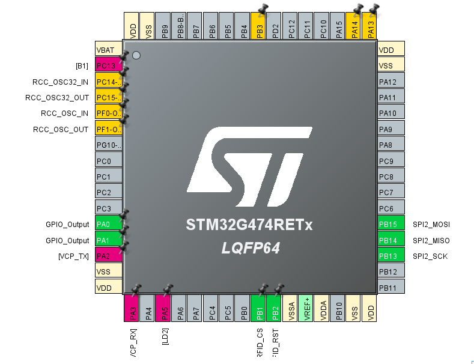
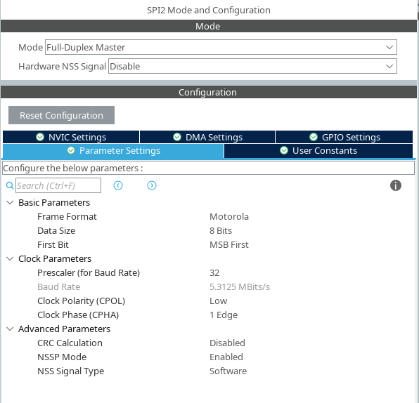
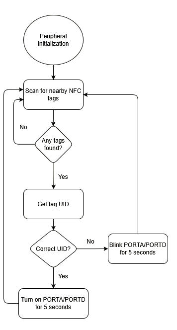

# SPI RFID

## About

This is a project implementing contactless Near Field Communication (NFC) and RFID between an ARM/AVR MCU and an MFRC522 RFID Module. More specifically, when the "correct" NFC tag (whose unique identifier is hardcoded into the project) is scanned, two LEDs (`PA{0,1}` on the STM32G474RE, `PD{0,1}` on the Atmega328PB) stay on for 5 seconds; otherwise, if a different NFC tag is scanned, these same LEDs blink repeatedly for 5 seconds. This simulates the functionality of an an RFID lock. 

The project has two major building blocks: the implementation of SPI communication on the aforementioned ARM/AVR boards, as well as the implementation of a multi-platform driver for the MFRC522 RFID module.

## Implementation

### SPI Communication - STM32G474RE

The configuration of the pins pertaining to the board's SPI communication (as well as the rest of the board's GPIO configuration) was done in STM32CubeMX, with the following settings:

As for the SPI transceive function, it was written based on the [user manual](https://www.st.com/resource/en/reference_manual/rm0440-stm32g4-series-advanced-armbased-32bit-mcus-stmicroelectronics.pdf) for the STM32G4xx boards. Additionally, the code was written using the LL (Low-Layer) libraries.

### SPI Communication - Atmega328PB

The code was written from scratch, based on the Atmega328PB MCU's [datasheet](https://ww1.microchip.com/downloads/en/DeviceDoc/40001906A.pdf).

### MFRC522 RFID Module Driver

The implementation of the driver is based on the RC522's [datasheet](https://www.nxp.com/docs/en/data-sheet/MFRC522.pdf). It uses the previously implemented SPI drivers to communicate with the module, and it contains functions for the proper initialization of the module, detection of nearby NFC tags, etc. 

Additionally, it is portable as-is across the supported MCUs thanks to platform-specific macros (`__AVR__`, `STM32G474xx`) and conditional compilation (`#if defined()`).  

### Main Project - RFID Lock

The main project's structure is shown in the following flowchart:

## Additional Notes

Whilst the files for the RFID lock project are separated, according to their MCU platform, a unified multi-platform project file (`main-multiplatform.c`) is also included  that serves as a proof of concept for the portability of the project's code using conditional compilation; however, it is not presently functional due to the lack of the needed custom build system (eg. a cross-platform Makefile), which may be added in a future update.  
